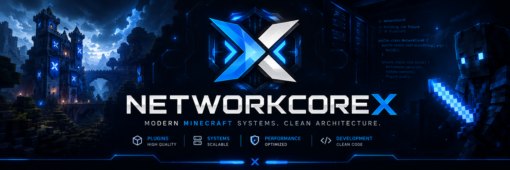

# ⚡ NetworkCoreX

### Modern Minecraft Systems. Clean Architecture.

 

 

---

# 🚀 About NetworkCoreX

**NetworkCoreX** is a modern development organization focused on advanced Minecraft systems, plugins, and technical infrastructure.

The main goal is to build:

* high-performance systems
* scalable architectures
* clean & maintainable code
* innovative Minecraft experiences

---

# 🛠️ Development Areas

### ⚙️ Minecraft Development

* Fabric Mods
* Paper / Spigot Plugins
* Server Systems
* APIs & Utilities
* Cosmetics & GUI Systems

### 🌐 Backend & Infrastructure

* Database Systems
* Network Communication
* Cloud & Hosting Tools
* Automation Systems

### 💻 Web Development

* Dashboards
* Modern Websites
* Control Panels
* APIs & Web Interfaces

---

# 📋 Philosophy

|   ⚡ Focus   |        💡 Goal        |
| :---------: | :------------------: |
|  Clean Code | Maintainable Systems |
| Performance |  Optimized Solutions |
|  Innovation |  Modern Technologies |
|  Community  |   Open Development   |

---

# 💻 Technologies

  
  
  
  
  
  
  
  
  

---

# 🧰 Tools & Software

  
  
  
  
  
  
  
  
  
  
  

---

# 🎯 Technical Standards

* 🧹 Structured & clean code
* ⚡ High performance & optimization
* 🏗️ Modern software architecture
* 🔒 Secure & scalable systems
* 📚 Continuous learning & improvement

---

# 📦 Projects

The repositories inside **NetworkCoreX** contain various Minecraft systems, infrastructure tools, and experimental development projects.

Every project is built to:

* explore modern technologies
* create innovative systems
* improve development workflows
* push technical boundaries

---

# 🤝 Community

Feedback, suggestions, and technical discussions are always welcome.

* 💬 Developer discussions
* 🔍 Project feedback
* 💡 Shared ideas & inspiration
* 🚀 Community-driven development

---

# 📬 Contact

Use the repository issues or discussions for technical questions and feedback.

---

# ⚡ NetworkCoreX

### Building modern Minecraft systems.

Made with ❤️, Java & late night coding

